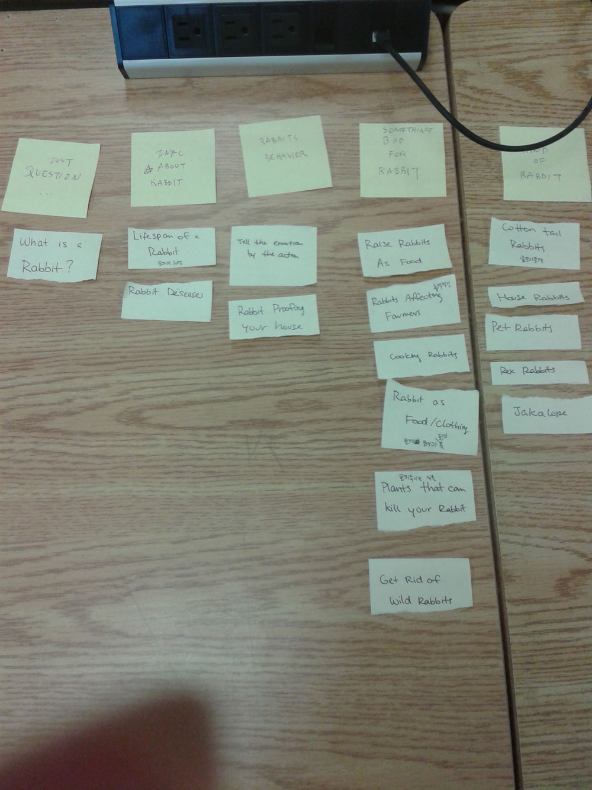
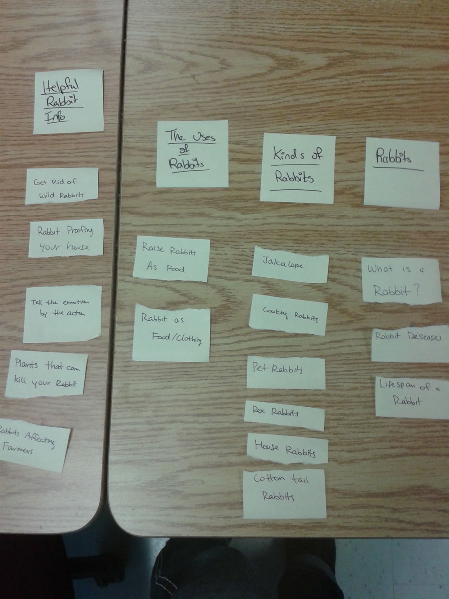

# Card sort report

The purpose of this card sort was to determine common navigation patterns and categories from the content of The Rabbit page

## Specifics

The card sort was conducted by Winnie Lau on Thursday, September 12, 2013 between the times of 3pm and 6pm with the following participants:

- Lauren
- Mariam

### Cards

16 cards were used covering a broad range of applicable content for the website. The following topics were used as cards:

1. What is a Rabbit
2. Rabbit Proofing your House
3. Plants that can kill your rabbit
4. House Rabbits
5. Get rid of wild rabbits
6. Raise Rabbits as food
7. Emotions by actions
8. Cooking Rabbits
9. Cotton tail rabbits
10. Rabbits affecting farmers
11. Pet Rabbits
12. Rabbit Diseases
13. Lifespan of a Rabbit
14. Rabbit as food/clothes
15. Jackalope
16. Rex Rabbit

## Card sort results

*Card sort 1 by Lauren*

*Card sort 2 by Mariam*

## Observations

- Did the participants have any common comments?
	- Both did not understand what a Jakalope is.

- Did they struggle with certain articles or topics?
	- the question about the Jakalope came up both times.

- Did they find common groupings? Or were the groupings completely different?
	- lifespan and rabbit diseases placed into right categories.
	- groupings were somewhat different, mostly because of a language barrier.

- Were some of the groupings completely unexpected?
	- I didn't expect that the article about cooking rabbits would go under a kind of rabbit (refer to card sort 2)
	- Although the section of things that are bad for rabbits makes sense, i feel that cooking them or using them as clothing technically belongs there, but it still is useful information (refer to card sort 1)

- Were the results similar to your expectations?
	- I expected more of: uses of rabbit, what you need to know if you have them as pets, types of rabbits and  rabbits in the wild
	- I would say Marium would be the closest results I was looking for (refer to card sort 2)

- How did you feel while watching them perform the task?
	- i felt that some articles were easier to sort than others, probably because they were somewhat sub articles under a bigger section